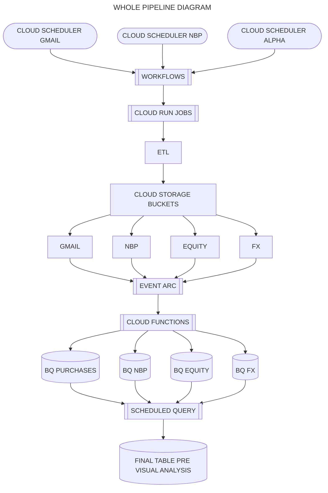

___
# Design Document

By Marcin Borowski

Video overview: [NOT AVAILABLE YET]()

GitHub repo: [repository](https://github.com/MrSz-84/xtb_ike_via_gmail)

Version: **0.2.6**

 

## _DISCLAIMER_ :
#### This project is under construction, and currently focusing on ways of automation, and gathering data from various sources. As of ~~2025-07-06~~ 2025-09-14 it is capable of:
1. Gathering purchases data from my gmail account.
2. ETL the data gathered from emails, read pdf's transform them into dataframes, load to cloud storage, and from there to BigQuery table.
3. Calling NBP's (Narodowy Bank Polski or Polish National Bank) API for USD PLN currency exchange rates of mid, ask and bid (average, sell and buy rates). 
4. ETL the data, blend two api calls together, and process them into one data struct, upload to cloud storage, and transport to a BQ table.
5. Call Alpha Vantage API for equity quotation data for assets owned by me, and FX market data for USD PLN exchange rates.
6. ETL the data, and process them into data structs, upload to cloud storage, and transport to a BQ table.
7. Execute scheduled SLQ query feeding main data table used by Looker Studio and in the future PowerBi for data visualisation.

#### What is planned:
1. ~~Finding a free API with exchange rates for three financial instruments I currently invest into via XTB broker.~~ **DONE**
2. ~~ETL the data.~~ **DONE**
3. ~~Transport it into a base table in BQ.~~ **DONE**
4. ~~Create a schedule for gathering all above data into one table containing a timeline since the beginning of my invest to the day before present day (today - 1 day).~~ **DONE**
5. ~~Figuring out what and how do I need to calculate in order to seamless transition from BQ table to visualisation tools. Power Bi won't be a problem here, because it offers variety of advanced options to calculate things, but Looker Studio is a simpler tool, without advanced calculation tools, Thus most of the calculations needed are going to be done using SQL in BQ.~~ **DONE**
6. Find an automated source of inflation data for Polish economy.
7. Find some data for benchmarks purposes of my portfolio. (WIG?, SWIG80?, S&P500?, MSCI WORLD?)
8. Finding a way to gather data from other retirement accounts I have (PPK and Polish tresury bonds) and transport them into BQ.
9. Blend them into one table.
10. Recalculate stuff.

## Scope

This project came to life serving two main purposes:

As a learning process of GCP (because I use some of it in daily work), its ecosystems, data pipelines and automation, also the way to connect to existing tables via data visualisation tools such as Looker Studio and Power Bi.

As a place, to store and visualise the state of my retirement portfolio. It is modeled on few charts I've seen on myfund app/page, and wanted to check if I'm able to make something similar for my own noncommercial usage. In simple terms, I want to see how my investment is doing, what is it worth in PLN in time and if I make profits or loses.

* The database is going to store data gathered from my ovn retirement accounts, publicly available or free API containing currency exchange rates or financial instrument's daily closing prices.
* It *includes*, USD PLN currency exchange rates by day gathered and published by NBP, daily prices of three financial instruments (ETF's) with tickers IWDA.UK, EIMI.UK IGLN.UK. In future probably also Polish tresury bonds base investment, and current value including interests and the amounts and prices of TFI that my PPK invests in.

 

> **NOTE**
>
> Code used in this project is mainly Python, followed by SQL used in BQ queries, and Yaml used in Cloud Workflows which invoke Cloud Run Job's to live and task execution. 
> At this time I'm wondering if I should include Yaml configuration code in this repository.

 

## Functional Requirements

The database / dataset is going to help with:

* Storing presice amounts of my purchases in one place.
* Storing USD PLN exchange rates and closing prices of chosen ETF's/ETC's for given days.
* Providing updates of the data after purchase, and after each closed day.
* Enabling data edition and correction.
* Creating of rapports, tables, charts, analysis etc.
* Reading the data to other environments such as Power Bi, Looker, Pandas, Matplotlib, or simply providing tables in pure SQL queries.
* Monitoring the state of my investments.

## Representation
The data is being transferred into SQL tables as mentioned below. In compliance to the Google's recommendation I'll use wide format and one big table to store the final data format. This one table is going to be powered by other smaller chunks of data gathered from various named sources.

### Entities of a database/dataset

#### <u>alpha_equity_data</u>

The `alpha_fx_data` table contains the data about the daily quotation rates for assets bought via broker and stored in `xtb_transactions_import`. This table contains such numerical columns as: **open**, **high**, **low**, **close**, **volume**, and a symbol of quoted asset ( at the time of writing this text only three tickers are placed here: IWDA.UK, EIMI.UD, IGLN.UK ), by working days. Each row must have entries in all columns, therefor `REQUIRED` constraints were added. Columns included in this table are:

- `date` unique for given symbol. Formated as `DATE` in ISO 8601 format. 
- `open` which is the price at which the first transactions took place that day. This column is of `FLOAT` format.
- `high` which is the highest price at which transactions took place that day. This column is of `FLOAT` format.
- `low` which is the lowest price at which transactions took place that day. This column is of `FLOAT` format.
- `close` which is the selling price at which transactions last transaction took place that day. This column is of `FLOAT` format.
- `volume` which is the number of all transaction took place that day. This column is of `INTEGER` format.
- `symbol` Represented as `STRING` format.

#### <u>alpha_fx_data</u>

The `alpha_fx_data` table contains the data about the exchange rates for four types of representation: **open**, **high**, **low**, **close**, from symbol, to symbol, and the name of a currency pair ( at the time of writing this text only USD PLN pair is represented in the table), by working days. Each row must have entries in all columns, therefor `REQUIRED` constraints were added. Columns included in this table are:

- `date` unique for given currency, at this time it can be considered as `PRIMARY KEY`. Formated as `DATE` in ISO 8601 format. 
- `open` which is the price at which the first transactions took place that day. This column is of `FLOAT` format.
- `high` which is the highest price at which transactions took place that day. This column is of `FLOAT` format.
- `low` which is the lowest price at which transactions took place that day. This column is of `FLOAT` format.
- `close` which is the selling price at which transactions last transaction took place that day. This column is of `FLOAT` format.
- `from` Represented as `STRING` format.
- `to` Represented as `STRING` format.
- `symbol` Represented as `STRING` format.

#### <u>nbp_usdpln_exchange_rates</u>

The `nbp_usdpln_exchange_rates` table contains the data about the exchange rates for three types of representation: **mid**, **ask**, **bid**, the name of a currency ( at the time of writing this text only USD PLN pair is represented in the table), by working days. Each row must have entries in all columns, therefor `REQUIRED` constraints were added. Columns included in this table are:

- `Date` unique for given currency, at this time it can be considered as `PRIMARY KEY`. Formated as `DATE` in ISO 8601 format. 
- `Currency` Represented as `STRING` format.
- `mid` which is the average price at which transactions took place that day. This column is of `FLOAT` format.
- `ask` which is the buying price at which transactions took place at the end of that day. This column is of `FLOAT` format.
- `bid` which is the selling price at which transactions took place at the end of that day. This column is of `FLOAT` format.

#### <u>xtb_transactions_import</u>

The `xtb_transactions_import` table, contains information about every transaction I made via XTB brokerage account. (As a test it's designed as a wildcard table containing dates of data acquisition in their name. This stacks nicely into one table separated by day of ingestion. I know this is not an ideal solution, yet I wanted to learn something new in this topic, and I did.). As of the end of June 2025 this table was reconfigured to a normal table. Each row must have entries in all columns, therefor `REQUIRED` constraints were added. Columns included in this table are:

- `NumerZlecenia` which is the unique identification number of each transaction, type `INTEGER` was used here.
- `Symbol` which represents the equity bought as a ticker. This column is of `STRING` type.
- `NazwaInstrumentu` this column represents the name of equity provided by issuer/broker. It also contains the currency in which it's quoted. Thus `STRING` was used as a type.
- `SystemWykZlecenia` which is the name of the system via which given transaction was processed, thus `STRING` was used as type.
- `Wolumen` which is the amount of equity bought. This can be a sum of an integer (whole laws?) and a float (fractional laws?) thus `FLOAT` was used as type. In this particular table whole numbers and fractional shares are listed separately, but in the destination table this number is going to be grouped up after calculation of its current worth.
- `DataCzas` which represent the date and time of a transaction in ISO format, thus `DATETIME` was used as type.
- `ZlecenieOtwarcia` which states if a transaction was done as an automated triggered transaction or in person (via app or webapp). Thus type `STRING` was used.
- `CenaJedn` which contains the price of 1 share of given equity in USD, at which transaction was made. Thus type `FLOAT` was used.
- `CenaCalkowita` which contains the price of a whole purchase for given row calculated as `Wolumen * CenaJedn` of given equity in USD, at which transaction was made. Thus type `FLOAT` was used.
- `KlasaAktywow` which contains the information about the type of bought equity. Thus type `STRING` was used.
- `Waluta` which is the currency of a transaction. Thus type `STRING` was used.
- `KursPrzewalutowania` which is the exchange rate at which USD's were purchased before transaction. Thus type `FLOAT` was used.
- `KosztPrzewalutowania` which is the cost of the currency exchange. Thus type `FLOAT` was used.
- `Prowizja` which is the cost of the operation. Thus type `STRING` was used.
- `LaczneKoszty` which is the total cost of the operation described as `KosztPrzewalutowania + Prowizja`. Thus type `FLOAT` was used.

#### <u>retirement_portfolio</u>

The `retirement_portfolio` table, contains transformed data about the state of every symbol (asset) by daily granularity. This is the go-to table powering dashboard in Looker Studio [click](https://lookerstudio.google.com/s/qYSiM9ZzZ60), and PowerBi version here [click](https://www.novypro.com/project/retirement-portfolio-analysis-tool). Here all calculated, via an SQL query, values land. Columns included in this table are:

- `date` which represent the date since first transaction (portfolio creation date 2025-05-23) in ISO format, thus `DATETIME` was used as type.
- `symbol` which represents the equity bought as a ticker. In future also Polish bonds will be represented here, as a main type such as TOS or EDO. This column is of `STRING` type.
- `Waluta` which is the currency of a transaction. Thus type `STRING` was used.
- `asset` which is the representation of type of asset. At the moment ETF and ETC are present here, but in the future BONDS will appear. Thus type `STRING` was used.
- `volume` which is the amount of equity bought thus `FLOAT` was used as type. In this particular table whole numbers and fractional shares are listed as a volume sum of an asset.
- `running_volume` which is the cumulated amount over time of each equity bought thus `FLOAT` was used as type.
- `purchase_value` which contains the price of a purchase for given symbol at given day, calculated as `volume * purchaseprice` in USD. Thus type `FLOAT` was used.
- `running_purchase_value` which contains cumulated values of purchases for given symbol over time in USD. Thus type `FLOAT` was used.
- `purchase_value_in_pln` which contains the price of a purchase for given symbol at given day, calculated as `volume * purchaseprice` in PLN. Thus type `FLOAT` was used.
- `running_purchase_value_in_pln` which contains cumulated values of purchases for given symbol over time in PLN. Thus type `FLOAT` was used.
- `ttl_costs` which contains aggregated costs of all transactions made in a given day for given symbol in USD. Thus type `FLOAT` was used.
- `running_costs` which contains cumulated values of costs registered in `ttl_costs` for given symbol over time in USD. Thus type `FLOAT` was used.
- `ttl_costs_in_pln` which contains aggregated costs of all transactions made in a given day for given symbol in PLN. Thus type `FLOAT` was used.
- `running_costs_in_pln` which contains cumulated values of costs registered in `ttl_costs` for given symbol over time in PLN. Thus type `FLOAT` was used.
- `transaction_count` which contains the information about the number of transactions for given symbol and given day. This is based on `NumerZlecenia` from `xtb_transactions_import`. Thus type `INTEGER` was used.
- `running_transaction_count` which contains the information the amount of transactions cumulated over time for a given day. Thus type `INTEGER` was used.
- `eq_close_value` which holds the information about close prices for each bought ticker since the start of the portfolio. Thus type `FLOAT` was used.
- `current_value` which holds the information about the value of owned assets at a given day. This is calculated as `volume * eq_close_value`, but due to gaps in quotations at some days, this column contains null values as well. Thus type `FLOAT` was used.
- `running_current_value` this is the forward fill of gaps using data from `current_value`, gap equals to last know value and so on. Thus type `FLOAT` was used.
- `mid_ex_rate` this is the information about NBP MID exchange rates for given day. This column contains null values, because quotations aren't present on weekends and holidays. Thus type `FLOAT` was used.
- `current_value_in_pln` which holds the information about the value of owned assets at a given day in PLN. This is calculated as `current_value * mid_ex_rate`, but due to gaps in quotations at some days, this column contains null values as well. Thus type `FLOAT` was used.
- `running_current_value_in_pln` this is the forward fill of gaps using data from `current_value_in_pln`, gap encountered equals to last know value and so on. Thus type `FLOAT` was used.
- `is_last_date_in_week` this is a flag indicating which rows are last date in ISOWEEK, used for correct data (running totals) presentation at selected interval. Thus type `BOOL` was used.
- `is_last_date_in_month` this is a flag indicating which rows are last date in each MONTH, used for correct data (running totals) presentation at selected interval. Thus type `BOOL` was used.
- `is_last_date_in_quarter` this is a flag indicating which rows are last date in each QUARTER, used for correct data (running totals) presentation at selected interval. Thus type `BOOL` was used.
- `fx_ex_close_rate` this is the information about FX CLOSE exchange rates for given day. This column contains null values, because quotations aren't present on weekends and holidays. Thus type `FLOAT` was used.
- `running_current_fx_value_in_pln` this is the current market value calculated using volume and `fx_ex_close_rate`, forward filled through gaps at which quotations were absent. Thus type `FLOAT` was used.
- `all_pln_nbp_daily_drawdown` this is the maximum drop of whole portfolio's value in PLN since the maximum peak value over time. Here market value is calculated using NPB MID exchange rates. Thus type `FLOAT` was used.
- `all_pln_fx_daily_drawdown` this is the maximum drop of whole portfolio's value in PLN since the maximum peak value over time. Here market value is calculated using FX CLOSE exchange rates. Thus type `FLOAT` was used.
- `pln_nbp_daily_drawdown` this is the maximum drop of each symbol's value in PLN since the maximum peak value over time. Here market value is calculated using NPB MID exchange rates. Thus type `FLOAT` was used.
- `pln_fx_daily_drawdown` this is the maximum drop of each symbol's value in PLN since the maximum peak value over time. Here market value is calculated using FX CLOSE exchange rates. Thus type `FLOAT` was used.

### Entities of a codebase

> **NOTE**
>
> This codebase is a bit fluid, and adapted to changing environmental requirements, understanding of the process and faced limitations.
> Main goal was launch everything from main, yet during the process I've realised, that separate files are going to be needed, because I did not want to build an app as a service controlled by API calls. So the name main.py stayed for the process of gathering and uploading data from gmail, and the rest is files with more suitable names. If you want to read more about this please read the file **WHAT_HAD_TO_BE_OVERCOME.md** (NOT YET AVAILABLE).

#### main.py
This file contains the code for gathering data from gmail account ath which transaction data is being sent to me. The data is in pdf unfortunately, so it has to be read and transformed to a tabular data, then the upload to Cloud Storage bucket can be done.

#### main_working_from_local.py
Same as main.py, used for local testing purposes.

#### nbp_api_call_usd.py
This file contains the code for gathering data from NBP's API, regarding currency exchange rates for my purchases in USD. It can be easily scaled up to retrieve other currencies as EUR

#### alpha_api_call_etfs.py
This file contains the code for gathering data from Alpha Vantage's API, regarding currency exchange rates for my purchases in USD (FX market). It can be easily scaled up to retrieve other currencies as EUR. It also enables me to acquire quotation rates for given symbols (equity tickers) in daily granularity. This part can also be easily scaled up.

#### run_func_etl_nbp.py
The code used in Cloud Run (Services) Functions linked to Eventarc linked to the bucket in which currency exchange rates lands (`nbp_api_call_usd.py`). It transports data from file into BigQuery `nbp_usdpln_exchange_rates` table.

#### run_func_etl_xtb.py
The code used in Cloud Run (Services) Functions linked to Eventarc linked to the bucket in which XTB equity purchases information lands (`main.py`). It transports data from file into BigQuery `xtb_transactions_import` table.

#### run_func_etl_alpha_equity.py
The code used in Cloud Run (Services) Functions linked to Eventarc linked to the bucket in which Alpha Vantage equity quotation rates information lands (`alpha_api_call_etfs.py`). It transports data from file into BigQuery `alpha_equity_data` table.

#### run_func_etl_alpha_fx.py
The code used in Cloud Run (Services) Functions linked to Eventarc linked to the bucket in which Alpha Vantage FX exchange rates information lands (`alpha_api_call_fx.py`). It transports data from file into BigQuery `alpha_fx_data` table.

#### get_data_from_alphavantage_equity_and_fx.yaml
The code used in Workflows, linked to Cloud Scheduler to invoke Cloud Run Job responsible for ETL data from Alpha Vantage API. It transforms data into the csv files uploaded to Cloud Storage.

#### get_data_from_gmail_job_invocation.yaml
The code used in Workflows, linked to Cloud Scheduler to invoke Cloud Run Job responsible for ETL data from Gmail. It read PDF files from my broker and transforms them into a csv file. It transports data into Cloud Storage.

#### get_data_from_nbp_exchange_rates_job_invocation.yaml
The code used in Workflows, linked to Cloud Scheduler to invoke Cloud Run Job responsible for ETL data from NBP API. It transforms data into the csv file uploaded to Cloud Storage.

 

#### **PIPELINE PROCESS DIAGRAM**
 

 
WHOLE PIPELINE HIGH OVERVIEW
 

